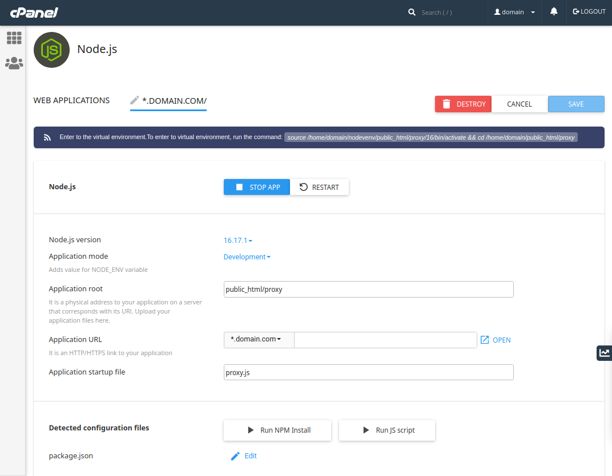

# nodejs-proxy-simple

- This implement is a proxy server run on a shared hosting (cPanel, Apache/LiteSpeed).



# Get Started

- Only a `proxy.js` or `pure-proxy.js` file is necessary.

## Install

- Install dependencies:
  ```bash
  yarn
  ```

## Setup

- Server:
  - yarn start
- Shared Hosting:
  - Upload `proxy.js` and `node_modules` to `public_html/proxy`.
  - Configure as in above picture.
  - Point domain/subdomain DNS to shared hosting's IP
